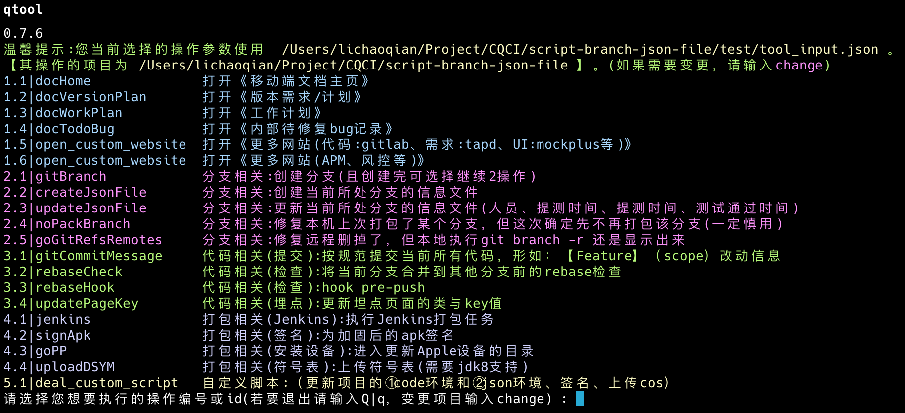
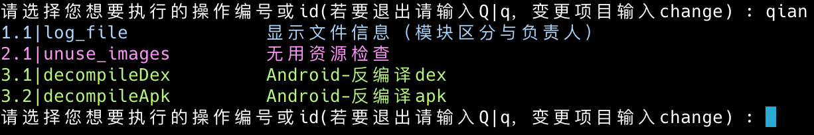

# script-branch-json-file
工具脚本的集合


## 安装

```shell
brew tap dvlpCI/qtool

brew install qtool
# 如果上述安装命令执行失败，可能需要进入如下命令，删干净 qtool 相关问题
open /usr/local/var/homebrew/
```

## 更新

```shell
# 更新
brew update
brew upgrade qtool

# 删除
brew uninstall qtool
```

其他：

**因为 qtool 依赖qbase，请确保先执行 brew install qbase 安装 qbase。且安装过程请确保相应地址非private，即 https://github.com/dvlpCI/homebrew-qbase 和 https://github.com/dvlpCI/script-qbase 都不能private， 否则会导致qbase下载失败**


## 帮助

```bash
输入 `qtool -help` 其会提示支持的命令。这里可得支持的命令及其含义分别为 {"-quickCmd":"快捷命令","-path":"支持的脚本"}
输入 `qtool -path` 查看所有支持的 脚本关键字 ，包含 "quickCmd" 和 "support_script_path" 分类。
```


## qtool 下的脚本书写必备知识点

### 1、获取 qtool 所操作的目录

因为类似提交代码等都是针对指定的项目目录去操作的，所以你得了解你操作的是哪个项目目录。获取 qtool 所操作的目录的方法如下：

```bash
# 获取操作的项目路径（即为哪个项目提交git记录）
source ${qtoolScriptDir_Absolute}/base/get_system_env.sh
project_dir=$(get_sysenv_project_dir)
```

### 2、配置文件路径解析规则

配置文件中的路径有两种解析方式，通过字段名后缀区分：

| 字段名后缀 | 基准目录 | 说明 |
|-----------|---------|------|
| 无后缀 | 项目目录 | 如 `personnel_file_path`，相对于 `home_path_rel_this_dir` 计算出的项目目录 |
| `_rel_this_file` | 配置文件所在目录 | 如 `personnel_file_path_rel_this_file`，相对于 `tool_params_file_path` 所在目录 |

#### Shell 脚本（getAbsPathByFileRelativePath）

```bash
# 参数:
#   $1: file_path - 配置文件路径（如 /path/to/project/test/tool_input.json）
#   $2: rel_path - 相对路径（如 ./tool_input_personel.json）
# 结果: /path/to/project/test/ + ./tool_input_personel.json

function getAbsPathByFileRelativePath() {
    file_parent_dir_path="$(dirname $file_path)"
    joinFullPath_checkExsit "${file_parent_dir_path}" "${rel_path}"
}
```

#### Python 脚本（get_fileOrDirPath_fromToolParamFile）

```python
# 参数:
#   tool_params_file_path: 配置文件路径
#   keypath: 字段路径，如 "personnel_file_path" 或 "personnel_file_path_rel_this_file"
# 结果: 根据 keypath 后缀决定基准目录

def get_fileOrDirPath_fromToolParamFile(tool_params_file_path, keypath, shouldCheckExist=False):
    if keypath.endswith("_rel_this_file"):
        base_dir_path = os.path.dirname(tool_params_file_path)  # 相对于文件所在目录
    else:
        base_dir_path = getProject_dir_path_byToolParamFile(tool_params_file_path)  # 相对于项目目录
    # 拼接路径...
```

#### 配置示例

假设 `project_home_dir_path` = `/path/to/project`

 `tool_params_file_path` = `/path/to/project/test/tool_input.json` 内容为：

```json
{
  "project_path": {
    "home_path_rel_this_dir": "../"
  },
  "personnel_file_path_rel_this_file": "./tool_input_personel.json",
  "branchJsonFile": {
    "BRANCH_JSON_FILE_DIR_RELATIVE_PATH": "./src/example/featureBrances/"
  }
}
```

则

- 以 `_rel_this_file` 结尾的示例 `personnel_file_path_rel_this_file` 

  `/path/to/project/test/tool_input.json`+"./tool_input_personel.json" → `/path/to/project/test/tool_input_personel.json` ✅

- 无 `_rel_this_file` 结尾的示例 `BRANCH_JSON_FILE_DIR_RELATIVE_PATH`

   `/path/to/project` + "./src/example/featureBrances/" → `/path/to/project/src/example/featureBrances/` ✅


## qtool.sh 的测试方法

原理：未发布的肯定是在/Users目录下，而已发布的在/usr/下

### 1、测试未发布的qtool.sh

判断依据：脚本的绝对路径在用户目录下

```bash
CurrentDIR_Script_Absolute="$(cd "$(dirname "$0")" && pwd)"
if [[ "${CurrentDIR_Script_Absolute}" == /Users/* ]]; then
    isTestingScript=true
fi
```

### 2、测试已发布的qtool.sh

判断依据：传入 test 参数

判断步骤：

1. 先检查 last_arg 是否是 verbose（--verbose 或 -verbose），如果是则设置 verbose=true，并检查倒数第二个参数是否是 test
2. 如果 last_arg 不是 verbose，则检查 last_arg 是否是 test

```bash
# 计算参数数量
count=$#
# 获取最后一个参数
last_arg=${!count}
# 获取倒数第二个参数（如果参数数量>=2）
if [ $count -ge 2 ]; then
    second_last_arg=${!((count - 1))}
fi
# 判断逻辑
if [ "$last_arg" == "--verbose" ] || [ "$last_arg" == "-verbose" ]; then
    verbose=true
    # 检查倒数第二个参数
    if [ "$second_last_arg" == "test" ] || [ "$second_last_arg" == "--local" ] || [ "$second_last_arg" == "-l" ]; then
        isTestingScript=true
    fi
else
    # 检查最后一个参数
    if [ "$last_arg" == "test" ] || [ "$last_arg" == "--local" ] || [ "$last_arg" == "-l" ]; then
        isTestingScript=true
    fi
fi
```


## 使用方法

在终端输入 `qtool` 即可显示菜单选择操作。




## 菜单介绍

| 菜单     | 用途                 | 对应文件                  | 调出命令            |
| -------- | -------------------- | ------------------------- | ------------------- |
| 常见菜单 | 处理常见操作，如上图 | `qtool_menu_public.json`  | `qtool`             |
| 私人菜单 | 处理私人操作，如下图 | `qtool_menu_private.json` | `qtool`菜单里输密码 |
|          |                      |                           |                     |




## 命令用法

| 命令 | 说明 |
|------|------|
| `qtool` | 显示菜单，选择操作 |
| `qtool cz` | 规范化 Git 提交（按规范填写 commit 信息） |
| `qtool help` | 显示帮助 |
| `qtool -version` | 查看当前版本 |


## 功能模块

### 分支管理

| 目录 | 用途 |
|------|------|
| `branch_quickcmd/` | 分支快捷命令（根据 rebase 分支获取映射） |
| `src/branchJsonFile_*.py` | 分支 JSON 文件创建/更新 |

### 应用上传

| 目录 | 用途 |
|------|------|
| `upload_arg_get/` | 获取上传参数（蒲公英等） |
| `upload/` | 应用上传（蒲公英、TestFlight、COS）及日志 |
| `dsym/` | dSYM 获取与上传（Bugly/火山引擎） |

### 打包 / 渠道

| 目录 | 用途 |
|------|------|
| `pack/` | 环境切换、代码替换、生成 IPA/APK |
| `channel_file/` | 渠道文件生成（360等） |

### 工具脚本

| 目录 | 用途 |
|------|------|
| `src/` | 核心工具（Git 操作、环境处理、APK 反编译、签名） |
| `common/` | 公共脚本 |
| `test/` | 测试 |

### 快捷命令

| 文件 | 用途 |
|------|------|
| `qtool.sh` | 主命令入口 |
| `qtool_menu.sh` | 菜单选择 |
| `qtool_quickcmd.sh` | 快捷命令 |
| `qtool_change.sh` | 切换环境 |


## 版本记录

### 0.0.7 (2026-04-14)

- 【Feature】`def get_fileOrDirPath_fromToolParamFile`: 新增 `_rel_this_file` 后缀支持：字段名以 `_rel_this_file` 结尾时，相对于配置文件所在目录解析

### 0.0.6 (2026-04-14)

- 【Fix】修复 `qtool help` 、 `qtool cz`  运行失败的问题 

### 0.0.1 (2023-04-15)

* 初始版本

